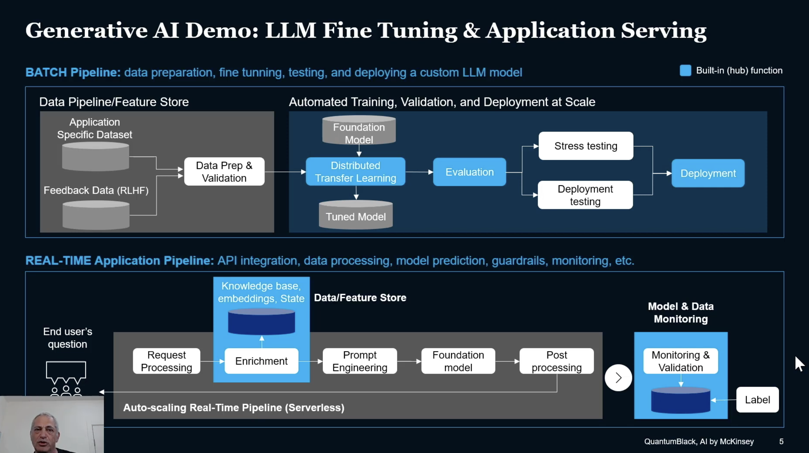

# **MLOpsPedia** - The MLOps Master Bot

This demo demonstrates how to fine tune a LLM and build an ML application: the **MLOps master bot**! We'll train [`gpt2-medium`](https://huggingface.co/gpt2) on [**Iguazio**'s MLOps blogs](https://www.iguazio.com/blog/) and cover how easy it is to take a model and code from development to production. Even if its a big scary LLM model, MLRun will take care of the dirty work!

We will use:
* [**HuggingFace**](https://huggingface.co/) - as the main machine learning framework to get the model and tokenizer.
* [**DeepSpeed**](https://www.deepspeed.ai/) - as the distributed training framework.
* and [**MLRun**](https://www.mlrun.org/) - as the orchastraitor to operationalize it, moving it from development to production.

The demo contains a single [notebook](./tutorial.ipynb) that covers the two main stages in every MLOps project: 

* **Training Pipeline Automation** - Demonstrating how to get an existing model (`GPT2-Medium`) from HuggingFace's Transformers package and operationalize it through all of its life cycle phases: data collection, data ppreparation, training and evaluation, as a fully automated pipeline.
* **Application Serving Pipeline** - Showing how to productize the newly trained LLM as a serverless function.

You can find all the python source code under [/src](./src)

Be sure to check out Yaron Haviv's video [Deploying Hugging Face Models to Production at Scale with GPUs](https://www.nvidia.com/en-us/on-demand/session/gtcspring23-s51553/)
to get a walkthrough of a simillar demo.

___

## Installation

This project can run in different development environments:
* Local computer (using PyCharm, VSCode, Jupyter, etc.)
* Inside GitHub Codespaces 
* Sagemaker studio and Studio Labs (free edition) or other managed Jupyter environments

### Install the code and mlrun client 

To get started, fork this repo into your GitHub account and clone it into your development environment.

To install the package dependencies (not required in GitHub codespaces) use:
 
    make install-requirements
    
If you prefer to use Conda or work in **Sagemaker** use this instead (to create and configure a conda env):

    make conda-env

> Make sure you open the notebooks and select the `mlrun` conda environment 
 
### Install or connect to MLRun service/cluster

The MLRun service and computation can run locally (minimal setup) or over a remote Kubernetes environment.

If your development environment support docker and have enough CPU resources run:

    make mlrun-docker
    
> MLRun UI can be viewed in: http://localhost:8060
    
If your environment is minimal, or you are in Sagemaker, run mlrun as a process (no UI):

    [conda activate mlrun &&] make mlrun-api
 
For MLRun to run properly you should set your client environment, this is not required when using **codespaces**, the mlrun **conda** environment, or **iguazio** managed notebooks.

Your environment should include `MLRUN_ENV_FILE=<absolute path to the ./mlrun.env file> ` (point to the mlrun .env file 
in this repo), see [mlrun client setup](https://docs.mlrun.org/en/latest/install/remote.html) instructions for details.  
     
> Note: You can also use a remote MLRun service (over Kubernetes), instead of starting a local mlrun, 
> edit the [mlrun.env](./mlrun.env) and specify its address and credentials  